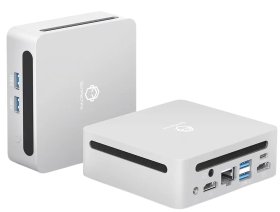
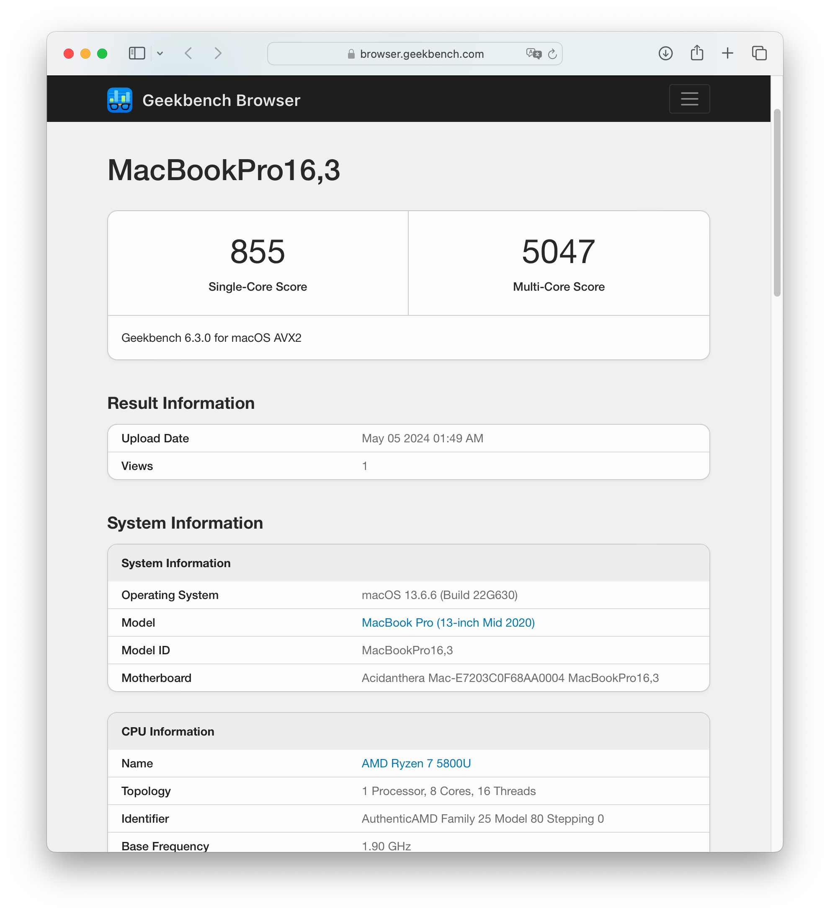

# Ryzentosh GenMachine Ren5000 (Ryzen 7 5800U) — macOS Big Sur → Sequoia

  

  

---

## Acerca de

EFI/guía para **GenMachine Ren5000** con **AMD Ryzen 7 5800U** orientada a ejecutar macOS en un entorno Ryzentosh. Incluye capturas de rendimiento y una base de configuración BIOS para reducir problemas comunes.

> Nota: En Ryzen, la compatibilidad depende fuertemente de versión de macOS, kexts y configuración. Ajusta tu EFI a tu hardware exacto.

---

## Estado / Compatibilidad

- **macOS:** Big Sur, Monterey, Ventura, Sonoma, Sequoia
- **Ryzentosh 2024**
- **OpenCore:** 1.0.0 (link de referencia arriba)

---

## Capturas

### macOS Ventura

---

## Rendimiento

### Geekbench 6 — macOS Ventura

---

## Especificaciones

| Componente   | Modelo |
|--------------|--------|
| CPU          | AMD Ryzen 7 5800U |
| Mini PC      | GenMachine Ren5000 |
| Memoria RAM  | 32GB DDR4 3200MHz |
| Gráficos     | AMD Radeon™ Graphics |
| Disco        | Western Digital 1TB WD Blue SN550 NVMe |
| Ethernet     | RealtekRTL8111 |
| BT/Wi-Fi     | Fenvi BCM94360NG |

---

## Configuración del BIOS

Aplica estos cambios (nombres pueden variar según BIOS/versión):

- **Advanced** → **Trusted Computing** → **Security Device Support** → **Disable**
- **AMD CBS** → **NBIO Common Options** → **IOMMU** → **Disabled**
- **GFX Configuration** → **IGPU Configuration** → **UMA Specified**
- **UMA Frame Buffer Size** → **16G**
- **Security** → **Secure Boot** → **Disabled**
- **Secure Boot Mode** → **Custom**
- **Boot** → **Quiet Boot** → **Disabled**
- **Boot** → **Fast Boot** → **Disabled**

---

## Recursos

- ISOs/RAW macOS (referencia): https://www.reiniertutoriales.com/isos-raw-macos/
- OpenCore 1.0.0 (build repo): https://github.com/dortania/build-repo/releases/download/OpenCorePkg-58f57a3/OpenCore-1.0.0-RELEASE.zip
